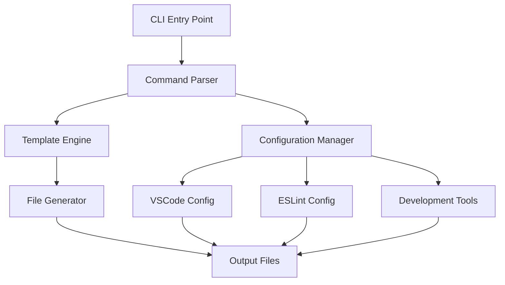

# Prompt Kit Architecture Documentation

## System Overview

Prompt Kit is a command-line interface (CLI) toolkit designed to scaffold and manage helper files for AI coding agents. It provides a structured approach to creating essential configuration files, templates, and development environment setups that enhance AI-assisted coding workflows.

The system is built as a Node.js CLI application using TypeScript, providing developers with a unified toolkit for:

- **AI Template Management**: Pre-built templates for structured development planning and task organization
- **Development Environment Configuration**: Optimized VSCode settings and workspace configurations
- **Code Quality Enforcement**: ESLint, Prettier, and Husky integration for consistent code standards
- **External Tool Integration**: Ready-to-use configurations for Model Context Protocol (MCP) servers

## Component Architecture

### Core Components



### 1. CLI Core (`src/index.ts`)

The main entry point handles:

- **Command Line Parsing**: Processes user arguments and flags
- **Help System**: Provides usage documentation and examples
- **Version Management**: Displays current version information
- **Error Handling**: Graceful error handling with user-friendly messages

**Key Classes:**

- `PromptKitCli`: Main CLI controller class
- Command parser with support for `--help`, `--version`, and custom name arguments

### 2. Template System (`templates/`)

The template system provides reusable scaffolds for AI-assisted development:

**Structure:**

```
templates/
└── rules/
    └── planning.md    # AI agent planning guidelines
```

**Template Categories:**

- **Planning Templates**: Structured formats for breaking down complex coding tasks
- **Rule Files**: Coding standards and AI agent behavior guidelines
- **Documentation Templates**: Consistent formats for technical documentation

### 3. Configuration Management

#### Development Tools Configuration

**ESLint** (`.eslintrc.mjs`):

- Code quality linting rules
- Integration with Prettier for code formatting
- Custom rules for AI-assisted development workflows

**Prettier** (`.prettierrc`):

- Code formatting standards
- Consistent indentation and styling
- Integration with lint-staged for pre-commit formatting

**TypeScript** (`tsconfig.json`):

- Strict type checking enabled
- ES2022 target with Node16 module resolution
- Source maps and declaration file generation

#### Version Management

**Volta** (via `package.json`):

- Node.js version pinning (v22.20.0)
- Consistent runtime environment across development machines

## Project Structure

```
prompt-kit/
├── 📁 src/                    # Source TypeScript code
│   └── index.ts              # Main CLI entry point
├── 📁 templates/             # AI agent templates and rules
│   └── rules/
│       └── planning.md       # AI planning guidelines
├── 📁 .vscode/               # VSCode workspace configuration
│   └── settings.json         # Custom color theme and editor settings
├── 📁 .husky/                # Git hooks for code quality
│   └── pre-commit           # Pre-commit linting hook
├── 📁 .github/               # GitHub-specific configurations
├── 📄 .gitignore           # Git ignore patterns
├── 📄 .npmrc               # npm configuration
├── 📄 eslint.config.mjs    # ESLint configuration
├── 📄 .prettierrc          # Prettier configuration
├── 📄 tsconfig.json        # TypeScript configuration
├── 📄 package.json         # Dependencies and scripts
└── 📄 README.md           # Project documentation
```

### Directory Purposes

| Directory    | Purpose                     | Key Files                              |
| ------------ | --------------------------- | -------------------------------------- |
| `src/`       | Core TypeScript source code | `index.ts` - Main CLI implementation   |
| `templates/` | Reusable AI templates       | `rules/planning.md` - Agent guidelines |
| `.vscode/`   | Development environment     | `settings.json` - Custom theme         |
| `.husky/`    | Git hooks                   | `pre-commit` - Quality checks          |
| `.github/`   | GitHub integration          | workflows, templates                   |

## Template System Architecture

### Template Categories

1. **Planning Templates**
    - Structured development planning formats
    - Task organization frameworks
    - Progress tracking methodologies

2. **Rule Files**
    - AI agent behavior guidelines
    - Code quality standards
    - Documentation requirements

3. **Configuration Templates**
    - VSCode workspace settings
    - Development environment setups
    - Tool configurations

### Template Engine Design

The current template system is file-based with plans for expansion to:

- Dynamic template generation
- Interactive template selection
- Custom rule file creation
- Plugin-based template system

## Configuration Management

### VSCode Integration

**Custom Theme** (`.vscode/settings.json`):

```json
{
	"workbench.colorCustomizations": {
		"activityBar.activeBackground": "#2f7c47",
		"titleBar.activeBackground": "#215732"
	},
	"peacock.color": "#215732"
}
```

**Benefits:**

- Consistent visual identity across development environments
- Enhanced focus for AI-assisted coding sessions
- Custom color scheme for Prompt Kit projects

### Code Quality Tools

**ESLint Configuration** (`eslint.config.mjs`):

- Modern ESLint 9.x configuration format
- Integration with Prettier for formatting
- Custom rules for AI development workflows

**Prettier Configuration** (`.prettierrc`):

- Consistent code formatting across the project
- Integration with lint-staged for pre-commit enforcement

**Husky Integration** (`.husky/pre-commit`):

```bash
#!/usr/bin/env sh
npx lint-staged
```

**Lint-staged Configuration** (`package.json`):

```json
{
	"lint-staged": {
		"*.{js,ts}": ["eslint --fix"],
		"!*.{js,ts}": ["prettier --write --ignore-unknown"]
	}
}
```

## Integration Points

### Model Context Protocol (MCP) Server Integration

**Current Capabilities:**

- Ready-to-use configurations for MCP servers
- External API access templates
- Custom tool setup boilerplates

**Planned Features:**

- Advanced MCP server integration templates
- Plugin system for extensibility
- Interactive tool selection and configuration

### External Tool Connections

The architecture supports integration with:

- **Local MCP Servers**: Stdio-based servers running locally
- **Remote MCP Servers**: SSE-based servers for remote access
- **Custom Tools**: Boilerplates for creating new MCP integrations

## Development Workflow

### Build System

**TypeScript Compilation** (`tsconfig.json`):

```json
{
	"compilerOptions": {
		"outDir": "dist",
		"rootDir": "src",
		"target": "es2022",
		"module": "Node16",
		"strict": true
	}
}
```

**Build Commands** (`package.json`):

```json
{
	"scripts": {
		"build": "tsc",
		"dev": "tsc --watch",
		"start": "node dist/index.js"
	}
}
```

### Code Quality Workflow

1. **Development**:

    ```bash
    npm run dev      # Watch mode compilation
    ```

2. **Code Quality**:

    ```bash
    npm run lint     # Run ESLint
    npm run format   # Format with Prettier
    ```

3. **Pre-commit Hooks**:

    ```bash
    # Automatic via Husky
    # Runs lint-staged on staged files
    ```

4. **Production Build**:
    ```bash
    npm run build    # Full compilation
    npm run start    # Run compiled version
    ```

### Git Hooks Integration

**Pre-commit Quality Gates**:

- Automatic linting on staged files
- Code formatting enforcement
- Prevents commits with quality issues

**Husky Setup** (`.husky/pre-commit`):

```bash
npx lint-staged
```

## Technical Specifications

### Runtime Environment

- **Node.js**: Version 22.20.0 (pinned via Volta)
- **TypeScript**: ES2022 compilation target
- **Module System**: ES modules (`"type": "module"`)

### Development Dependencies

| Package       | Version | Purpose                       |
| ------------- | ------- | ----------------------------- |
| `typescript`  | ^5.0.0  | Type checking and compilation |
| `eslint`      | 9.37.0  | Code linting                  |
| `prettier`    | 3.6.2   | Code formatting               |
| `husky`       | 9.1.7   | Git hooks                     |
| `lint-staged` | 16.2.2  | Pre-commit linting            |

### Distribution

- **Main Entry**: `dist/index.js`
- **Package Manager**: npm
- **License**: MIT
- **Version**: 0.0.0 (pre-release)

## Future Architecture Evolution

### Planned Enhancements

1. **Advanced CLI Commands**:
    - Interactive template selection
    - Dynamic file generation
    - Custom scaffolding workflows

2. **Plugin System**:
    - Extensible architecture for custom tools
    - Third-party template integration
    - Custom MCP server configurations

3. **Enhanced Integration**:
    - VSCode extension development
    - IDE integration beyond VSCode
    - Advanced MCP server templates

### Scalability Considerations

- **Template Engine**: Designed for extension with plugin architecture
- **Configuration System**: Modular design for easy addition of new tools
- **CLI Interface**: Extensible command structure for future features

## Conclusion

Prompt Kit provides a solid foundation for AI-assisted development workflows through its modular architecture, comprehensive tooling integration, and focus on developer experience. The system is designed to evolve from its current CLI-centric approach to a more sophisticated platform supporting advanced AI coding agent integrations.

The architecture emphasizes:

- **Modularity**: Clear separation of concerns between CLI, templates, and configuration
- **Extensibility**: Plugin-ready design for future enhancements
- **Quality**: Comprehensive tooling for code quality and consistency
- **Integration**: Ready for MCP server and external tool connections
